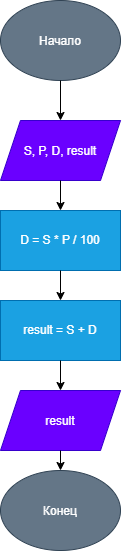

# Домашнее задание к работе 3

## Условие задачи
Написать и отладить программу вычисления дохода по вкладу (Дано: сумма вклада и процентная ставка)

## 1. Алгоритм и блок-схема

### Алгоритм
1. **Начало**
2. Объявить переменные:
   - `S` — сумма вклада.
   - `P` — процентная ставка.
   - `D` — доход.
   - `result` — итоговая сумма.
3. Ввести исходные данные:
   - Ввести `S` 
   - Ввести `P` 
4. Вычислить доход:
   - `D = S * P / 100` 
5. Вычислить итоговую сумму:
   - `result = S + D`
6. Вывести результат:
   - Вывести `result` 
7. **Конец**

### Блок-схема
 

(https://drive.google.com/file/d/1nqX_j30DV4dujbKSLB9yMxrcOjz7mvWB/view?usp=drive_link)

## 2. Реализация программы

#include <stdio.h>
#include <locale.h>

int main() 

{
    setlocale(LC_CTYPE, "RUS");
    double S, P, D, result;

    printf("Введите сумму вклада: ");
    scanf_s("%lf", &S);

    printf("Введите процентную ставку: ");
    scanf_s("%lf", &P);

    D = S * P / 100;
    result = S + D;

    printf("Доход: %.2lf\n", D);
    printf("Итоговая сумма: %.2lf", result);

}

## 3. Результаты работы программы

Введите сумму вклада: 14.7
Введите процентную ставку: 45.8
Доход: 6.73
Итоговая сумма: 21.43
C:\Student\VSProj\Lab3_dz\x64\Debug\Lab3_dz.exe (процесс 15880) завершил работу с кодом 0 (0x0).
Нажмите любую клавишу, чтобы закрыть это окно:

## 4. Информация о разработчике

Денисова София, бИЦТ-261
